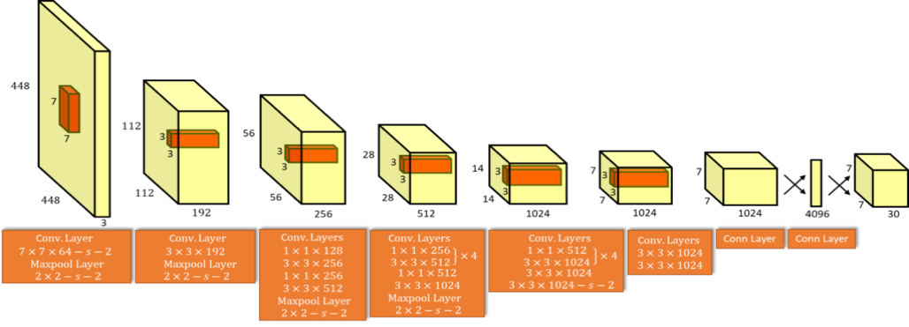
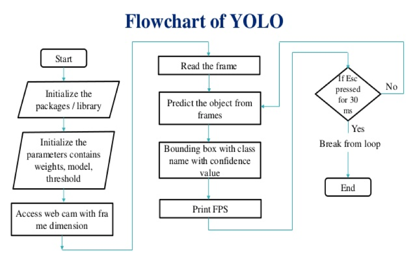
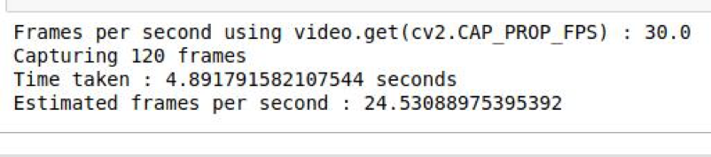
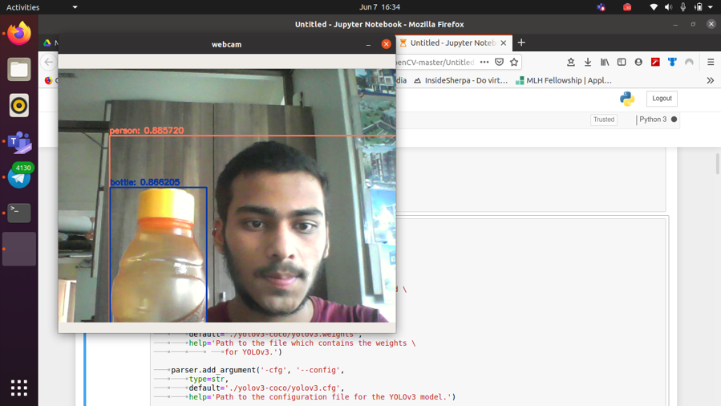
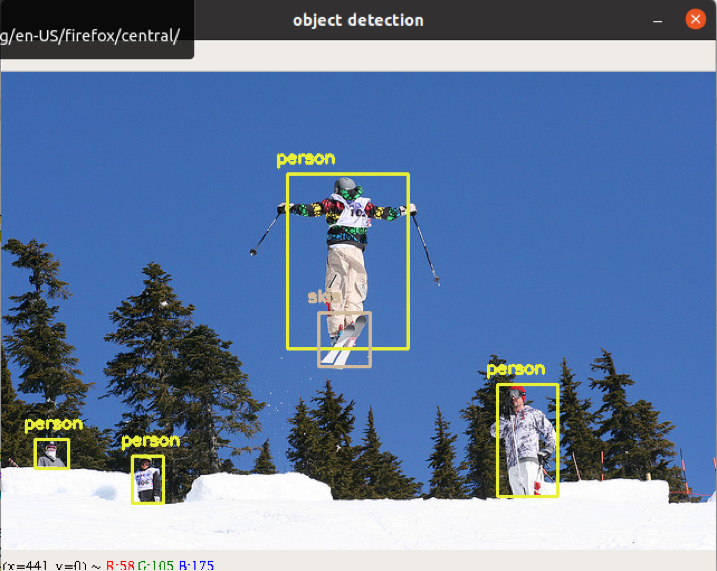
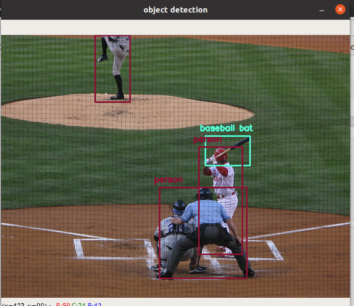
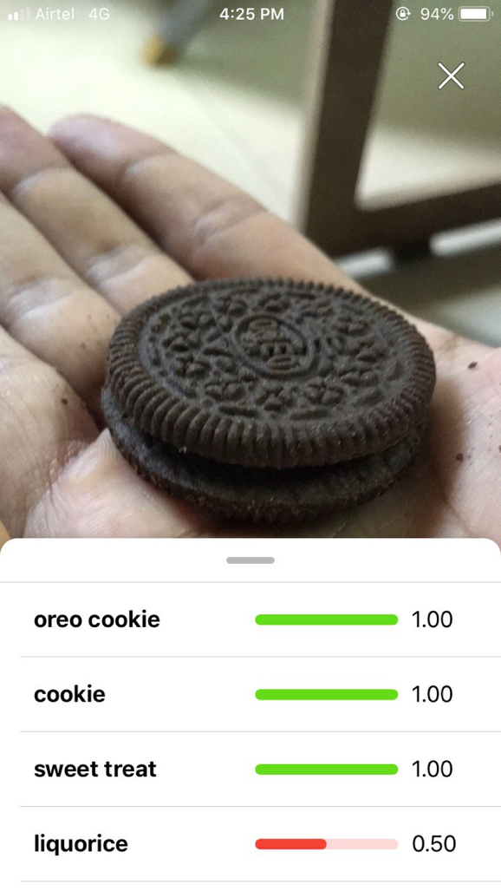
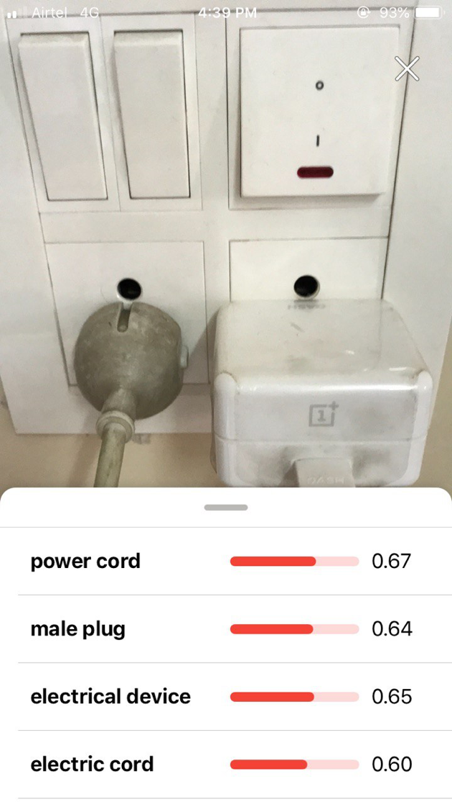
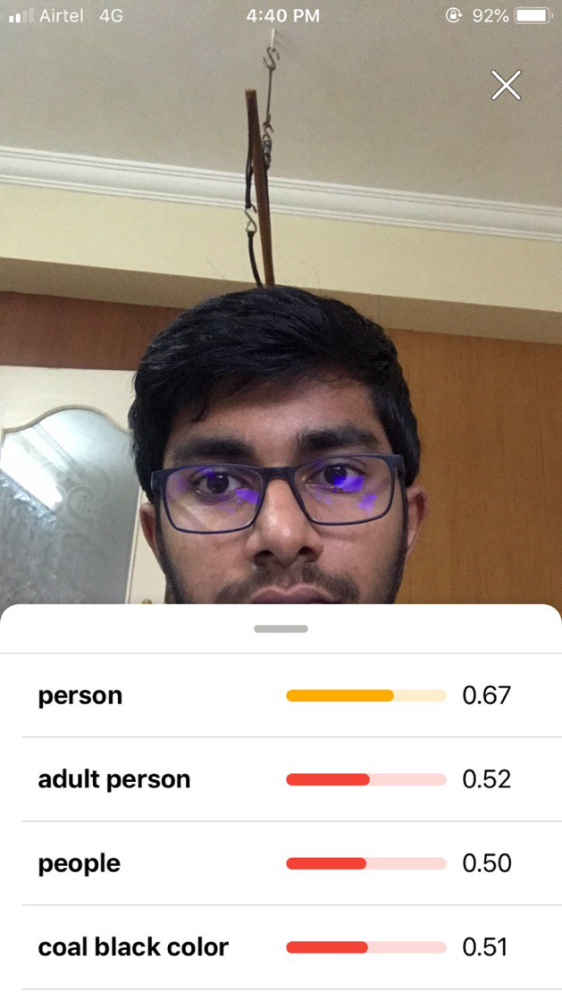

## Image Proceesing Project (CSE4019)
### Implementation of CNN for Real Time Object detection & comparing results of two different algorithms.

## Before You Start ⚠️

To run this project Download the weights from [https://pjreddie.com/media/files/yolov3.weights](https://pjreddie.com/media/files/yolov3.weights)

## YOLO Architecture 🏛

  
## FPS with YOLO 🖥

  
## YOLO Test Run 🏃‍

 
 
## IBM Bluemix API (IBM Watson) App 📱

 

## Comparative Table 🛠

| Parameter | YOLO  | Primitive R-CNN | Google Vision API | IBM Watson Bluemix API |
| ---------- | ------------- | ------------- | ------------- | -------------------- |
| **Realtime Performance** | Less performance hungry then other algorithms | CPU usage max out while running it. | No performance outage but network speed comes to matter | Same as Google Vision API |
| **FPS(Frames per second)** | Usually 30-50 FPS observed with decent hardware. But can increase with good GPU’s | Hardly 2-5 FPS observed due to deep and more complex neural network | Depends on network availability. Generally less than 25 FPS | Depends on network availability |
| **Memory Complexity** | Use more as compared to API’s but less than R-CNN | Heavy memory logging issue found which even slows down the host OS. | No memory overhead since API calling only depends on network | No memory overhead since API calling only depends on networky |
| **Performance** | Performance very good and can be used for commercially application like autonomous driving (Tesla cars) | Due to poor performance it is not viable to use for real time application. But it's good start for beginners since easy to learn concepts. | Again it depends on network performance like ping, data speed. But after successful deployment of 5G this will be the Industry standards. | Again it depends on network performance like ping, data speed. But after successful deployment of 5G this will be the Industry standards. |
| **Time Complexity** | Takes less time to compute. | Takes more time to commute since more performance hungry | Depends on network as well as server capacity to handle the request. | Depends on network as well as server capacity to handle the request. |
| **Reliability** | Most reliable of all since it is independent of network usage | Reliable but due to poor performance, not practical for use. | Not reliable for real time since the network can fluctuate anytime. If a stable network is provided then there can be the possibility of the server not able to handle a lot of request peak hours. | Not reliable for real time since the network can fluctuate anytime. If a stable network is provided then there can be the possibility of the server not able to handle a lot of request peak hours. |
| **Efficiency** | Efficient if good hardware is provided. | Not efficient | Efficient provided good network | Efficient provided good network |
| **Cost** | Cost effective given that use case satisfies the cost. | Costly since very expensive hardware is required for computation | Cheap since Google Vision API (GCP credit) $300 free per month | Cheap since Watson API is bundled with other services like NLP which can be integrated. |

## Conclusion 👏

YOLO is a unified model for object detection. This model is simple to construct and can be trained directly on full images. Unlike classifier-based approaches like RCNN and its other family, YOLO is trained on a loss function that directly corresponds to detection performance and the entire model is trained jointly. Fast YOLO is the fastest general-purpose object detector in the literature and YOLO pushes the state-of-the-art in real-time object detection. YOLO also generalizes well to new domains making it ideal for applications that rely on fast, robust object detection.

YOLO is a strong step towards closing the dataset size gap between de- tection and classification.
Many of our techniques generalize outside of object detection. Our WordTree representation of ImageNet offers a richer, more detailed output space for image classification. Dataset combination using hierarchical classification would be useful in the classification and segmentation domains. Training techniques like multi-scale training could provide benefits across a variety of visual tasks.
For future work we hope to use similar techniques for weakly supervised image segmentation. We also plan to improve our detection results using more powerful match- ing strategies for assigning weak labels to classification data during training. Computer vision is blessed with an enor- mous amount of labelled data. We will continue looking for ways to bring different sources and structures of data together to make stronger models of the visual world.

For the next coming decades we need to consider the upcoming technologies like **5G, quantum computing** which will be a giant leap for the field of AI. With the help of quantum computing’s performance and with the help of 5G connectivity this project will give scope in many fields like remote medical operation performed by doctors (AI in healthcare), Autonomous driving etc.

## Project Report ✉️

[Click here](https://github.com/sudnyeshtalekar/YOLO/blob/master/Project%20report/final_report.pdf)

## Authors

* [18BEE0201 - Sucheet Dumbre](https://github.com/theguy2048)
* [18BCE0791 - Siddhant Keskar](https://github.com/sjkeskar)
* [18BCE0809 - Sudnyesh Talekar](https://github.com/sudnyeshtalekar)
* [18BCE0811 - Devang](https://github.com/pateldevang)

## License

This project is licensed under the MIT License - see the [LICENSE.md](LICENSE.md) file for details

